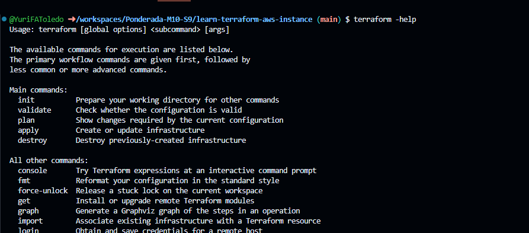
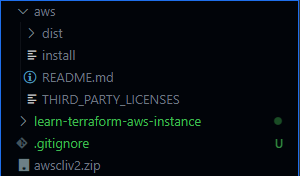
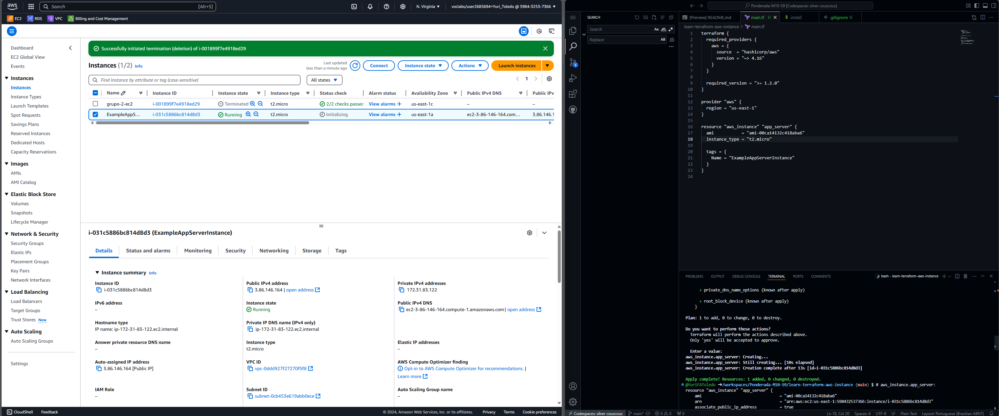

# Ponderada-M10-S9

Nesta ponderada, aprendemos a utilização básica do terraform e a seguir, serão narradas as etapas feitas.

## Verificação de dependências

Serão necessárias a utilização do AWS CLI e do terraform, além de informações de uma conta na AWS, que nesse caso, utilizou uma conta do Learn Lab.

Após seguir o tutorial de instalação do terraform, podemos verificar a instalação bem sucedida com o comando ``` terraform -help ```



Após seguir os tutoriais do AWS CLI, baixamos e descompactamos um zip chamado ``` awscliv2.zip ```, na imagem a seguir, observa-se o arquivo e o diretório aws criado após descompactação:



## Codificação do terraform

Nessa etapa, criamos o diretório específico e o arquivo ```main.tf```, onde provisionamos uma instância ec2 na região do Norte da Virgínia.

Com o comando ```terraform apply```, ele indica as alterações que serão feitas e após confirmação do usuário, aplica essas alterações na AWS.



Na imagem acima, identificamos o sucesso do terraform apply, ao exibir a instância no painel da AWS,seguido do comando no terminal.

## Conclusão

Agora, somos capazes de entender o fluxo de funcionamento do Terraform e como podemos versionar o provisionamento de recursos computacionais.